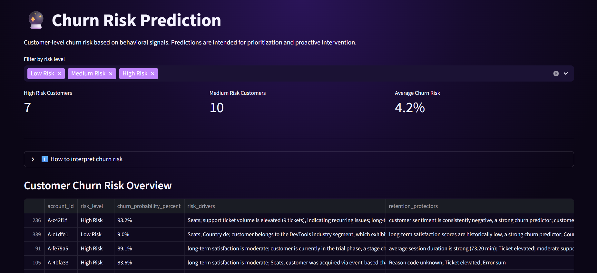
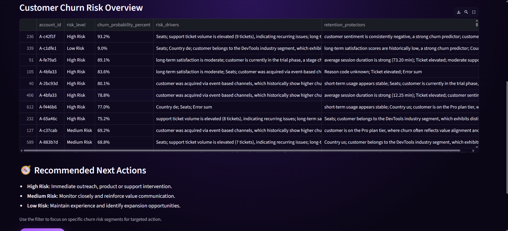
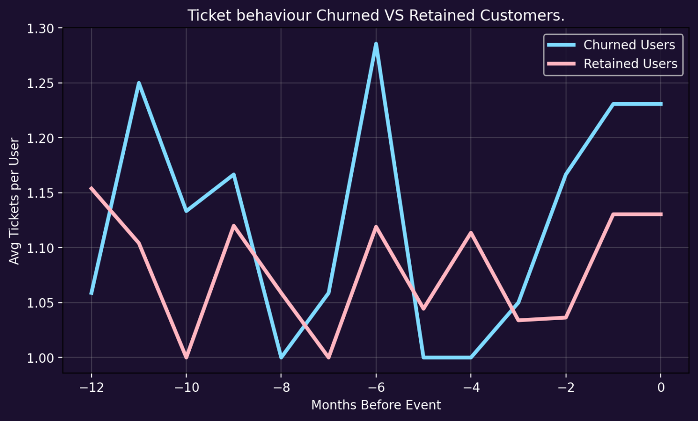

SaaS Churn Intelligence System

An end-to-end SaaS churn analysis and risk prioritization system designed to help product, growth, and analytics teams understand why customers churn, which features drive retention, and where to act first.

This project combines:

• behavioral analysis

• feature-level product insights

• churn risk prediction

• an interactive Streamlit dashboard

The focus is decision support, not just reporting.

Problem Context

Customer churn is one of the most expensive problems in SaaS.
However, churn is rarely caused by a single factor — it emerges from a combination of usage behavior, product experience, support friction, and customer sentiment.

This system was built to answer three core questions:

• Which product features are driving churn vs retention?

• What behavioral signals separate churned and retained customers?

• Which customers should teams prioritize for retention actions?

What This System Does

🔍 Behavioral Analysis

• Usage patterns (intensity, duration, recency)

• Satisfaction and sentiment signals

• Support ticket behavior

• Error and reliability indicators

🧩 Product-Level Insights

• Feature adoption and health scoring

• Churn-driving vs retention-anchor features

• Feature-specific churn risk

• Data-backed product action recommendations

🔮 Churn Risk Prediction

• Customer-level churn probability

• Risk banding (Low / Medium / High)

• Interpretable churn drivers

• Prioritization-focused predictions

📊 Interactive Dashboard

• Multi-view Streamlit dashboard

• Guided navigation and explanations

• Filters for risk level and insights

• Designed for product and analytics stakeholders


Tech Stack

• Python, pandas, numpy

• XGBoost, CatBoost (ensemble modeling)

• Feature selection & probability calibration

• Streamlit (multi-view interactive dashboard)

• Modular, production-style project structure


Dashboard Overview

The dashboard is organized into focused views:

• Home – System overview and navigation

• Product Breakdown – Feature-level usage and health

• Churn Drivers – Features and behaviors driving churn

• Bhaviour Analysis

• Feature analysis

• Industry based churn/retention analysis

• Retention Anchors – Signals supporting long-term retention

• Final Product Insights – Actionable recommendations

• Churn Prediction – Customer-level churn risk prioritization

The dashboard is designed to be exploratory but guided, with explanations provided where interpretation matters.

Screenshots


## Screenshots

### Home


### Final Product Insights
Key views from the final product insights module, showing feature-level diagnostics and recommended product actions.


<details>
<summary>Additional Product Insight Views</summary>


</details>

### Churn Risk Prediction




### Behavior Analysis



*The dashboard is organized as a self-contained Streamlit app inside the `dashboard/` folder.*

How to Run Locally
## How to Run the Dashboard Locally

The interactive Streamlit dashboard lives inside the `dashboard/` directory.

```bash
# Navigate to the dashboard folder
cd dashboard

# Install dependencies
pip install -r requirements.txt

# Run the Streamlit app
streamlit run app.py
```


Modeling Notes

• Models are trained on historical behavioral data

• Ensemble approach used to balance stability and performance

• Risk thresholds tuned for prioritization, not churn certainty

• Predictions are intended to help teams decide where to act, not to guarantee outcomes.

• Limitations & Next Steps

• Uses synthetic / sample SaaS-style data

• Model generalization depends on data quality and context

📄 **Detailed analysis and decision framework:**  
See the full report in [`reports/saas_churn_intelligence_report.md`](reports/saas_churn_intelligence_report.md)

Future improvements:
	
• real-time scoring

• deeper cohort analysis

• integration with product analytics tools


Author

Ridhisha Tyagi
